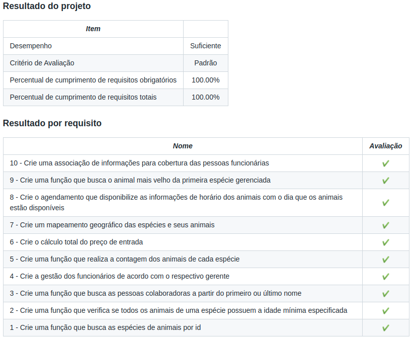

<h1>Sobre</h1>

Sétimo projeto do módulo 1 - Fundamentos, da <a href="https://betrybe.com" target="_blank">Trybe!</a>

Dessa vez foi o projeto Zoo Functions. A proposta era usar as HOF's (Higher Order Functions) para tratar os dados e retornar as respostas para determinadas pesquisas.

<h1>Tecnologias utilizadas</h1>
<ul>
  <li>JavaScript</li>
</ul>

<h1>Nota</h1>

